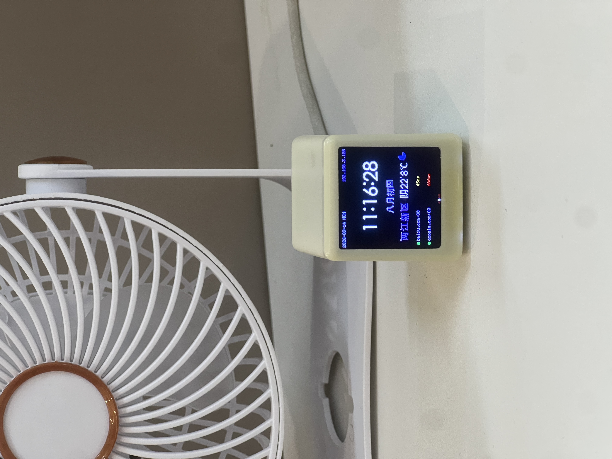

# SD2 小电视 — GeekMagic 开源固件

> 把 **SD2 小电视**（ESP8266 + ST7789 1.54" 方形屏）从"星光工作室"闭源商业固件
> 刷成 **[GeekMagic Open Firmware](https://github.com/Times-Z/GeekMagic-Open-Firmware)**：
> 全开源、带 Web 控制面板、支持 OTA 升级、可上传 GIF/图片、天气/时钟/日历。
>
> 本目录是一个自包含的整理仓库：硬件资料 + 已适配本板引脚的固件工程 + 编译/烧录脚本 + 编译产物，
> 便于复现与后续开源。
>
> 在原厂功能（Web 面板 / OTA / GIF 桌面 / NTP）基础上，新增了一块 **时钟天气主页**：
> 艺术大时钟、日期 + 星期 + 农历、Open-Meteo 天气、TCP 服务在线监控（如网关 `192.168.3.1:80`）。

[](firmware/GeekMagic-SD2/LICENSE)

## 📷 实物展示



## ⚠️ 刷机风险声明

刷机可能变砖。虽然 ESP8266 可救砖（串口擦除/重刷），但作者不为此负责。**请自行备份原厂固件**
（参考 `firmware/GeekMagic-SD2/backup/readme.md`，官方仓库已提供 7.0.17/9.0.40 原厂备份）。

## 目录结构

```
ESPDevices/
├── README.md                 # 本文件
├── hardware/                 # 硬件资料（官方开源仓库来源）
│   ├── SD2小电视.png          # 产品图
│   ├── SD2平面分布图.jpg      # 元件布局图
│   ├── notes/HARDWARE.md      # ★ 硬件详解（引脚映射/分区/镜像/救砖）
│   ├── schematic/             # 电路图 PDF（官方）
│   ├── bom/                   # BOM 物料表（xlsx + 网页版）
│   └── pcbs/                  # PCB 工程（Altium）+ 原理图
├── firmware/GeekMagic-SD2/   # ★ 已适配本板的固件工程（可编译）
│   ├── src/ include/ lib/ data/   # 源码 + Web UI
│   ├── platformio.ini
│   └── scripts/               # 官方 CI 脚本
├── scripts/
│   ├── build.sh               # 编译固件 + LittleFS
│   └── flash.sh               # 烧录（自动探测串口）
└── build/
    ├── firmware.bin           # 编译产物，刷 0x0
    └── littlefs.bin           # Web UI + config，刷 0x200000
```

## 硬件信息（速览）

| 项目 | 规格 |
|------|------|
| 主控 | ESP8266EX（ESP-12F，1MB Flash / 520KB RAM） |
| 屏幕 | ST7789 1.54" 方形 TFT，240×240，SPI，RGB565 |
| 屏幕引脚 | SCLK=14, MOSI=13, **CS=15**, DC=0, BL=5（无 RST） |
| 串口 | CH340C USB-C |
| 供电 | USB-C 5V，板载 AMS1117-3.3 |
| 可选件 | TTP223 触摸 / CH7800 音频（**本实物未贴片**） |

> 详细引脚映射、Flash 分区、显示镜像修正、救砖方法见 [`hardware/notes/HARDWARE.md`](hardware/notes/HARDWARE.md)。

## 快速上手

### 前置
- macOS / Linux，已安装 [PlatformIO](https://platformio.org/)（`pipx install platformio`）
- 一根 USB-C 数据线（能传数据，CH340 会被识别为 `/dev/cu.usbserial-*`）

### 一、直接烧录现成固件（最快，无需编译）
```bash
./scripts/flash.sh                    # 自动探测串口
# 或指定串口:
./scripts/flash.sh /dev/cu.usbserial-210
```
直接刷 `build/firmware.bin`（0x0）+ `build/littlefs.bin`（0x200000），设备重启后进入
配网流程（首次需通过 `GeekMagic` AP 或 Web 面板配置 WiFi，见下文）。

### 二、重新编译后再烧录
```bash
./scripts/build.sh                    # 产出 build/firmware.bin + build/littlefs.bin
./scripts/flash.sh
```

### 三、手动烧录（了解底层）
```bash
esptool.py --chip esp8266 --port /dev/cu.usbserial-210 --baud 115200 \
  write_flash 0x0 build/firmware.bin 0x200000 build/littlefs.bin
```
> 波特率用 **115200**；921600 在 ESP8266 上易报 `Invalid head of packet`。

## 首次连接与 Web 面板

1. 上电后设备尝试连接 `config.json` / NVS 中保存的 WiFi。
   若没有已保存网络，会回退到 `GeekMagic` AP 配网（见下）。
   可选：在 `src/main.cpp` 填入 `DEFAULT_WIFI_SSID/PASSWORD` 实现开机自动连网（默认为空）。
2. 从路由器/DHCP 找到设备 IP，浏览器打开 `http://<IP>` 进入 Web 面板。
   - 找不到 IP 时，设备会广播一个 **AP**：`GeekMagic`，密码 `$str0ngPa$$w0rd`，
     连接后访问 `192.168.4.1`。
   - **无需手动配置 token**：页面首次加载会自动调用未认证接口 `/api/v1/token/bootstrap`
     获取当前 token 并存入浏览器 localStorage，之后所有 API 调用自动带 `Authorization` 头。
     （若确需改 token，进 `token.html` 手动更新。）
3. Web 面板功能（`data/web/`）：
   - **WiFi**：配网 / 切换网络
   - **OTA**：在线上传固件升级
   - **GIF/图片上传**：桌面显示
   - **NTP**：时间同步
   - **屏幕旋转**：0~7
   - **API Token**：生成访问令牌（默认 `geekmagic2026`）
   - **日志 / 重启**

## 时钟天气主页（新增）

启动后主屏每秒渲染一次（无 GIF 播放时）：

| 分区 | 内容 |
|------|------|
| 顶部 | 艺术大时钟 `HH:MM`（44px 字体），居中 |
| 中部 | 日期 `YYYY-MM-DD` + 星期 + 农历（20px CJK 字体） |
| 天气 | 城市 + 实时天气（Open-Meteo，按 `weather_min` 间隔刷新） |
| 服务 | 最多 4 个 TCP 服务在线状态（按 `service_sec` 间隔探测） |

- 时区：`gmtime_r(epoch + tz_offset*3600)`，`tz_offset` 默认 `8`（东八区），不依赖 `TZ` 环境变量。
- 农历：内置 2020–2050 农历表（~23KB，存 flash `.irom.text`，`pgm_read` 读取），1837/1837 与 `lunardate` 校验一致。
- 字体：STHeiti Medium，CJK 20px + 时钟 44px，1bpp 位图存 flash。
- 相关配置（`data/config.json` / Web 面板）：`lat`/`lng`/`city`/`services`/`weather_min`/`service_sec`/`tz_offset`。

> 首次使用：`config.json` 内 WiFi 字段为空时，设备连上已保存网络后进入正常流程；
> 未保存则回退到 `GeekMagic` AP 配网。内置默认 WiFi（`main.cpp` 的 `DEFAULT_WIFI_*`）默认为空，
> 可自行填入实现开机自动连网。

## 踩坑与修复记录

- [`docs/flash-crash.md`](docs/flash-crash.md) — ESP8266 把只读数据放 flash 的完整踩坑：
  `PROGMEM` 按变量命名 section 破坏代码/字面量池布局、`.irom0.text` vs `.irom.text`、
  LX106 不支持 flash 非对齐 8/16 位读、`pgm_read` 被编译器优化成裸 load 等，及最终稳定方案。

## 本仓库相对原固件做的适配

| 改动 | 文件 | 原因 |
|------|------|------|
| CS 引脚改为 GPIO15（原 `-1`/GND） | `include/config/ConfigManager.h`、`src/display/DisplayManager.cpp` | 原仓库针对 HelloCubic 屏 CS 常低，本板 CS 在 15 且主动驱动，不改则黑屏 |
| 屏幕水平镜像修正 | `src/display/DisplayManager.cpp` 新增 `lcdFlipHorizontalMirror()` | ST7789 rotation=4 时内容左右镜像，翻转 MADCTL 的 MX 位 |
| 内置默认 WiFi + 连接回退 | `src/main.cpp`、`data/config.json` | 首次启动免配网直连 |
| Token 自动引导（开箱即用） | `src/web/Api.cpp` 新增 `/api/v1/token/bootstrap`（未认证）、`data/web/js/utils.js`、`logsHandler.js`、`otaUploadHandler.js` | 原设计需手动去 token.html 粘贴 token，否则所有按钮 401 报 Failed；现首次访问自动获取并存入 localStorage |

## 源码与许可证

- 固件基于 [Times-Z/GeekMagic-Open-Firmware](https://github.com/Times-Z/GeekMagic-Open-Firmware)（**GPLv3**）。
- 硬件资料来自官方 [wfm123456/SD2AIO](https://gitee.com/wfm123456/SD2AIO)（作者王福敏/星光工作室）。
- 二次修改遵循 GPLv3 开源要求，详见 [`firmware/GeekMagic-SD2/LICENSE`](firmware/GeekMagic-SD2/LICENSE)。

## 救砖

```bash
# 擦除 NVS（解决连不上网/config 损坏）
esptool.py --chip esp8266 --port /dev/cu.usbserial-210 erase_region 0x9000 0x5000
# 完全重刷
./scripts/flash.sh /dev/cu.usbserial-210
```
> ESP8266 几乎不会变砖——只要串口芯片（CH340）在，总能用 esptool 重刷。
